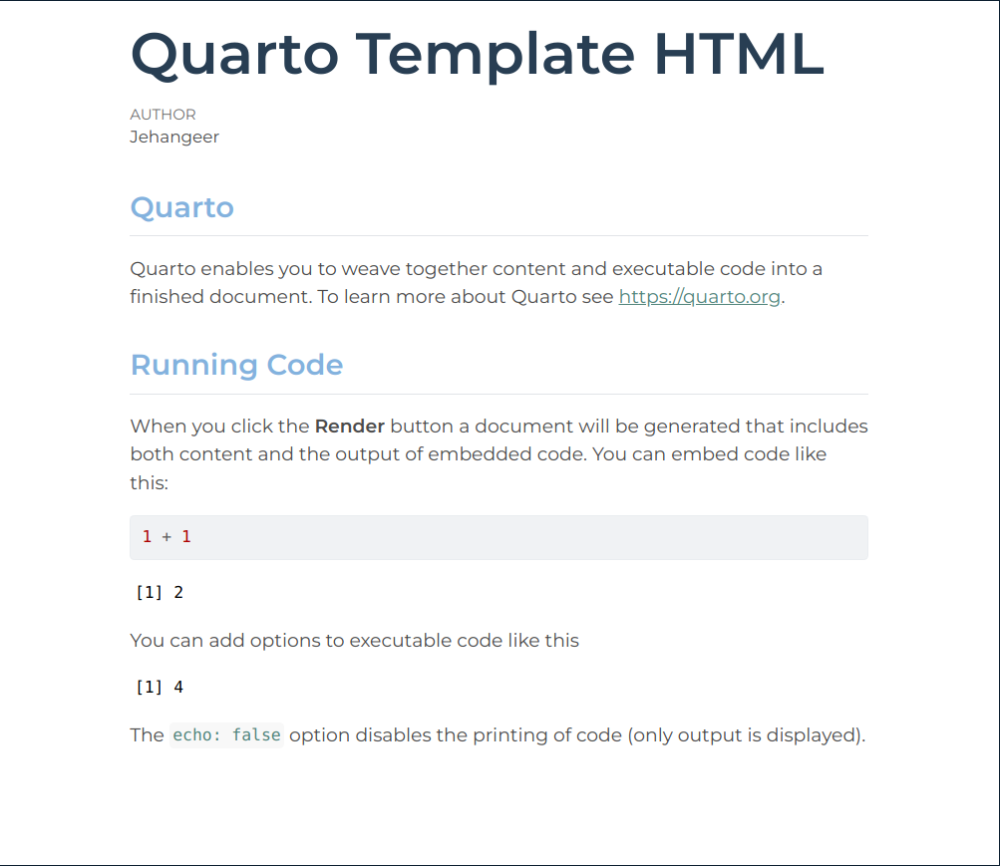

## Personal Quarto HTML Template

This repository contains a custom Quarto HTML template designed to suit my personal preferences and requirements.

Quarto is a versatile document authoring and publishing tool that allows for flexible customization of output formats, including HTML. This template can be easily integrated into Quarto projects to produce HTML documents tailored to individual needs.

## Example HTML Document

### License

This template is provided under the [MIT License](LICENSE). Feel free to modify and use it according to your needs.